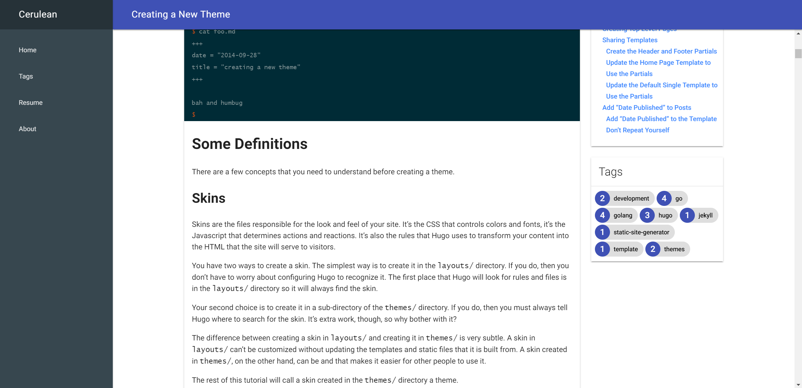

# GoMDL

A Hugo Theme using MDL.

## Screenshots

### Desktop




### Mobile

List View                  |  Post View
:-------------------------:|:-------------------------:
  |  

## Demo

[Link](https://xugr.me/GoMDL)

## How to build a demo

1. Follow Hugo's [Quick Start](https://gohugo.io/getting-started/quick-start/) to create a new site.

1. Clone this repo to your `themes` dir.

1. Copy files in `exampleSite` to the site dir, and remove or rename the default `config.toml`.

1. `hugo server`

## Configurations(`config.toml`)

```yaml
baseURL: "http://xugr.me/GoMDL"
relativeURLS: true
canonifyURLs: false
title: "Cerulean"
theme: "GoMDL"
permalinks:
  post: /post/:year/:month/:title/
  page: /:filename/
taxonomies:
  tag: "tags"
preserveTaxonomyNames: true
Paginate: 9
buildFuture: True

menu:
  main:
      - Name: "Home"
        Weight: 1
        Identifier: "home"
        URL: ""
      - Name: "Tags"
        Identifier: "tags"
        Weight: 2
        URL: "tags"
      - Name: "Resume"
        Identifier: "resume"
        Weight: 3
        URL: "resume"

params:
  Disqus: # your disqus name
  AuthorName: # author name
  Footnote: "Built with ❤"
  # Primary Color - Accent-Color from https://getmdl.io/customize/
  Theme: "indigo-blue"
  Highlight: "solarized-dark"
```